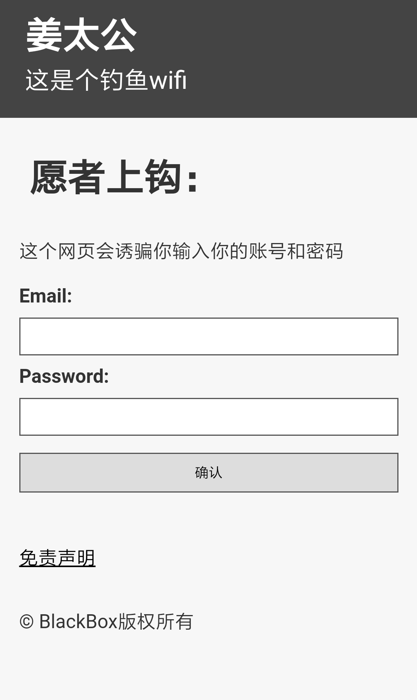
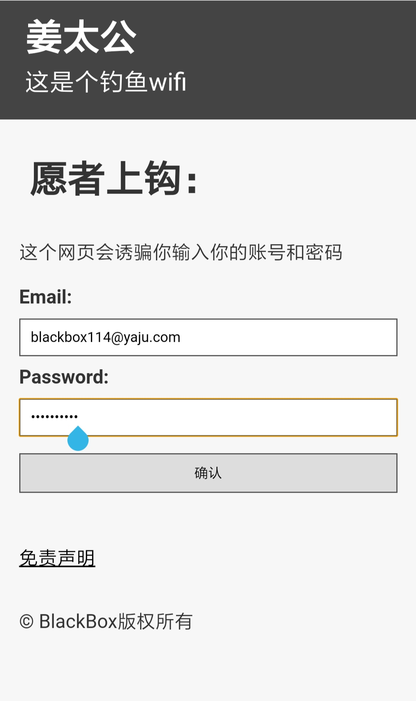
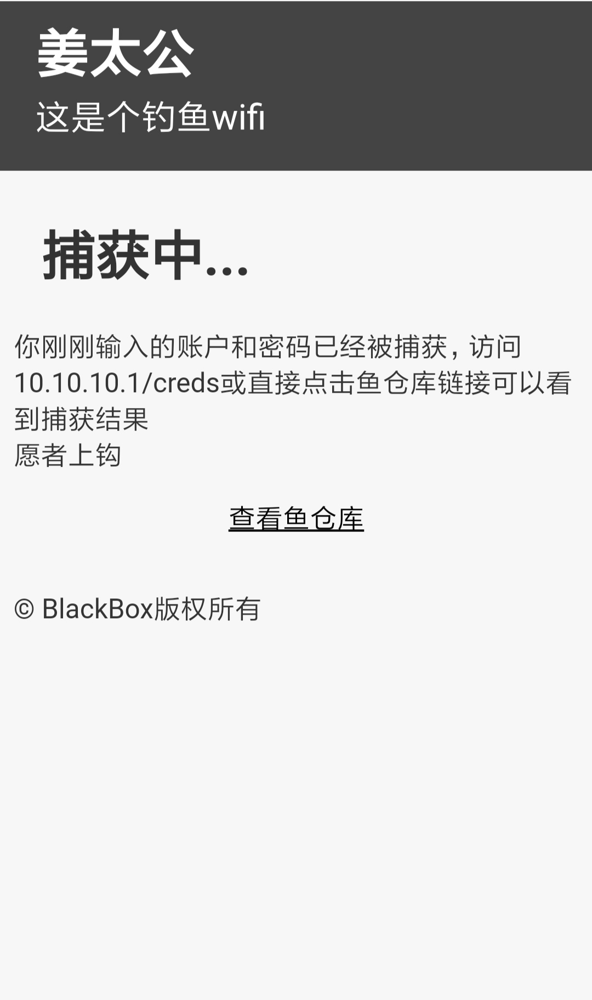
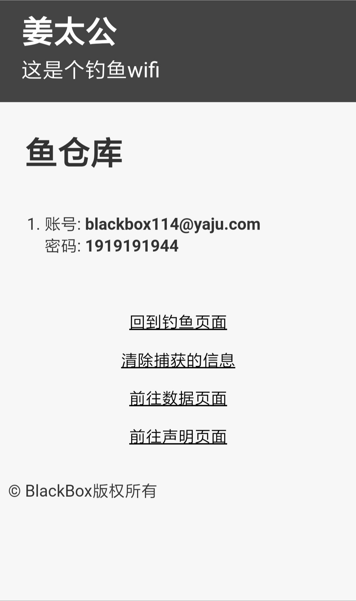
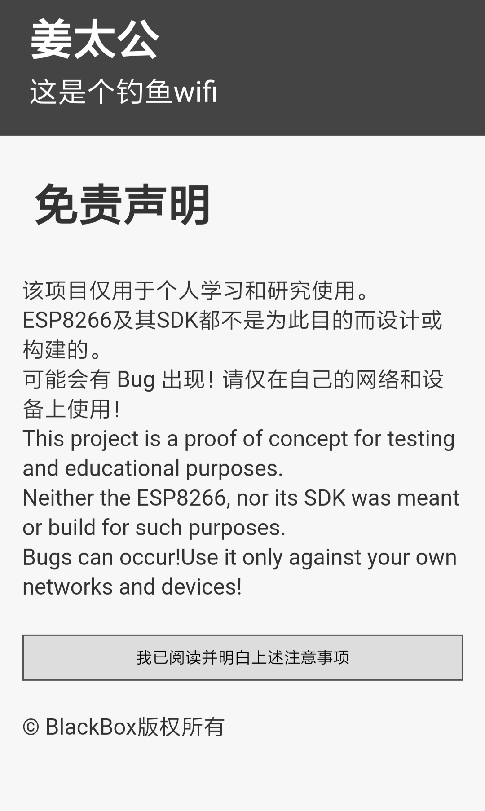
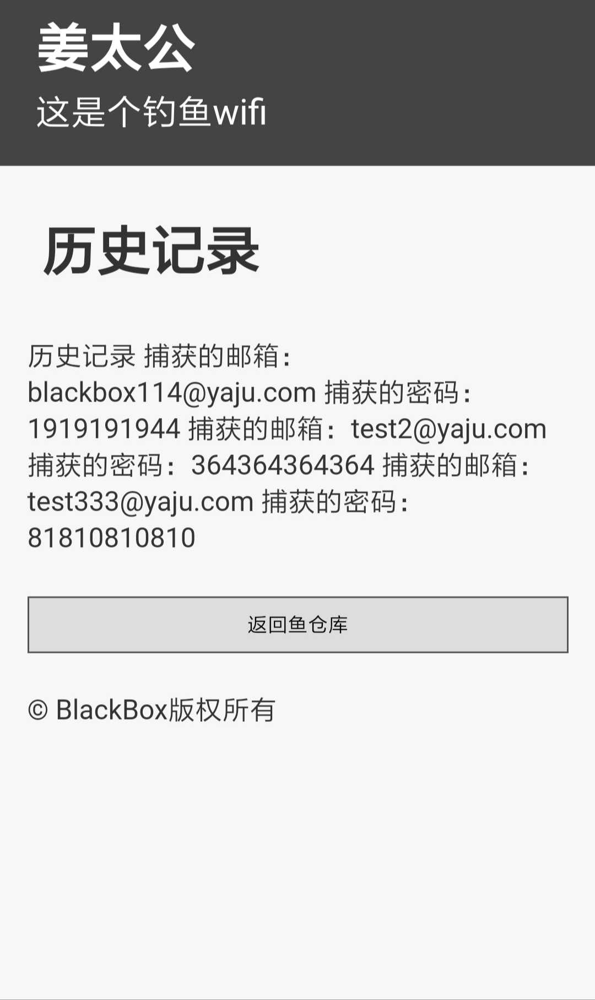
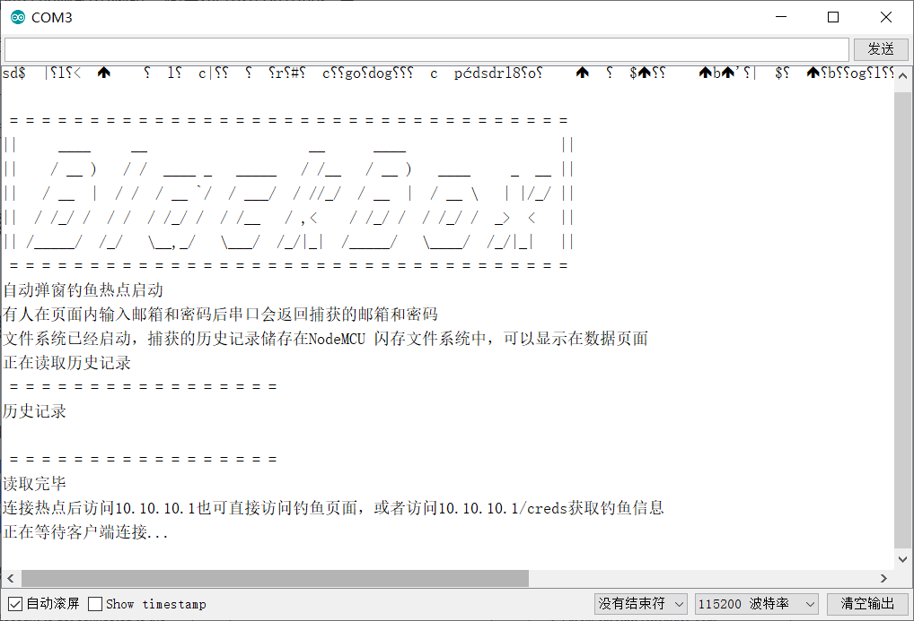
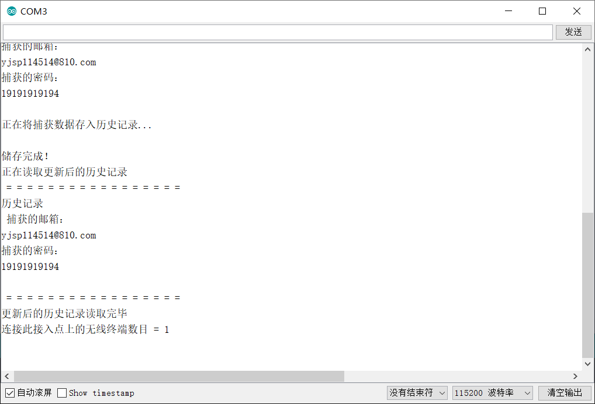

# Captive_Portal_Gofishing(姜太公)
### 简介

一旦连接上就会强制弹出钓鱼页面的热点。为了避免一些不必要的麻烦，页面各处都注明了这是个钓鱼wifi的警告，校园恶作剧版本也只提供了二进制文件。由于没有怎么接触过前端，所以把各个部分分开写（反正也是字符串形式储存的），不同页面调用不同的部分即可制造更换了页面的效果。但是这个方法反而违背了我图简单的初衷，不方便增删改，于是从此以后的设计全部使用载入储存在SPIFFS中的html的形式。关于SPIFFS的用法，可以参考[太极创客介绍SPIFFS的页面](http://www.taichi-maker.com/homepage/esp8266-nodemcu-iot/iot-c/spiffs/) 。

### 设计指标

①连接wifi即可强制弹出一个要求输入电子邮箱和密码的窗口

②捕获的邮箱和密码会保存在NodeMCU 闪存文件系统（SPIFFS）中的history.txt里面，掉电后不会消失

③串口输出捕获的邮箱和密码，输出history.txt里的信息

④data页面上可以直接显示history.txt的内容

⑤info页面上有免责声明和说明

⑥game页面上有等待鱼上钩打发时间的小游戏

### 物料清单

NodeMcu(ESP-12E)开发板

### 页面效果

钓鱼页面

<table>
  <tr>
    <th>10.10.10.1/</th>
    <th>10.10.10.1/</th> 
    <th>10.10.10.1/post</th>
  </tr>
  <tr>
    <td></td>
    <td></td>
    <td></td>

管理页面

<table>
  <tr>
    <th>172.0.0.1/creds</th>
    <th>172.0.0.1/info</th> 
    <th>172.0.0.1/data</th>
  </tr>
  <tr>
    <td></td>
    <td></td>
    <td></td>

### 串口输出
开启串口监听，波特率为115200。上电后会看到这样的输出。此时*历史记录.txt*里面是没有捕获内容的，所以只能读出“历史记录”这四个字

当有人输入了邮箱和密码，会立刻执行一次写入数据，把捕获的内容新增到*历史记录.txt*内，并显示出来

## 免责声明
该项目用于测试和教育目的。请限制在您自己的网络和设备上使用它。 若您对程序进行不当修改或在不适宜的场合使用该项目造成不良后果，我不承担任何责任。请遵守您所在国家和地区的相关法律法规。

The project is used for testing and educational purposes. Please only use project on your own device. If you make improper modifications to the program or use the project in an inappropriate place to cause undesirable consequences, I will not be held responsible. Please abide by the relevant laws and regulations of your country and region.